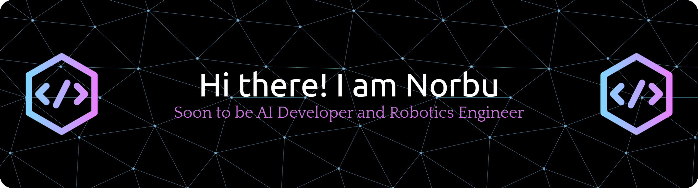

<h1 align="center">Hi there, I'm Norbu 👋</h1>
<h3 align="center">A Passionate AI Developer and Robotics Engineer from Bhutan</h3>

 

---

---

### 🛠️ Tech Stack

  <h4>Programming & Databases</h4>
  

    
    
    
    
    
    
    
    
  

  <h4>AI & Machine Learning</h4>
  

    
    
    
    
  

  <h4>Web Dev & Tools</h4>
  

    
    
    
    
    
    
    
    
    
    
    
    
  

  <h4>Robotics & Hardware</h4>
  

    
    
    
    
    
  

---

### 📊 GitHub Stats:

<a href="https://github.com/anuraghazra/github-readme-stats">
  

  

---

### 🤝 Connect with Me:

